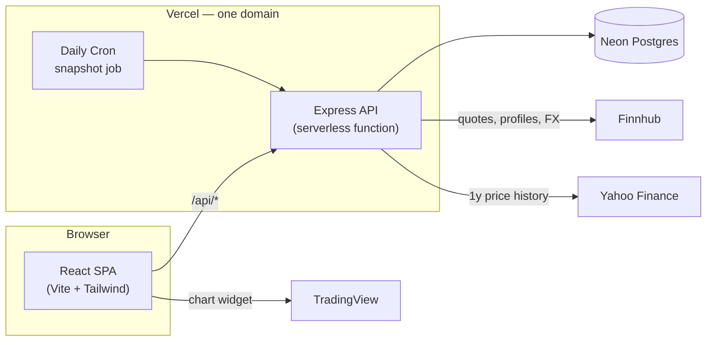

# MyStock

**Know what your portfolio is actually worth.**

MyStock is a multi-user web app for tracking a US stock portfolio. You log your
own buys and sells; it turns that into average cost, realized and unrealized
P/L, allocation, and live valuation — no spreadsheet required.

[**Live app →**](https://my-stock-ochre.vercel.app/)
[](https://github.com/kornkorn25/My-Stock/actions/workflows/ci.yml)

---

## What it does

**Portfolio tracking**
- Log buys and sells; holdings, average cost, and realized/unrealized P/L are
  recomputed from the full transaction ledger every time — never nudged, always
  replayed, so the numbers can't drift out of sync with reality
- Fractional shares work everywhere, down to 8 decimal places
- Dashboard with portfolio totals, a value-over-time chart, an allocation
  breakdown, and a holdings table
- Size a buy by share count or by a money budget ("I have $500, how many
  shares is that?")
- Per-stock target allocation, flagged when you drift over it

**Market data & analysis**
- Near-real-time quotes, proxied through the backend so no API key ever
  reaches the browser
- TradingView chart per stock with EMA 50/100/200
- Support and resistance levels computed from clustered swing highs/lows over
  a year of daily price history, scored by touch count and recency — not a
  single-day pivot formula
- Live currency toggle (USD / THB) for the portfolio summary

**Accounts**
- Email/password signup with required email verification, or sign in with
  Google
- Change your name, email, or password — email and password changes are
  confirmed by a link sent to your inbox
- Every account only ever sees its own data; there's no cross-account leakage
  by construction (every query is scoped to the authenticated user)

---

## How it's built

A few rules the codebase sticks to throughout:

1. **The transaction ledger is the only source of truth.** Holdings are a
   derived cache, rebuilt by replaying the full ledger on every write —
   running it twice gives the same answer.
2. **Money is never a float.** Prices, quantities, and P/L are `Decimal`
   (Prisma + decimal.js) end to end, both server- and client-side.
3. **Charts are for looking, not for computing.** The TradingView widget is
   free and view-only; every number on the page comes from the backend.
4. **Third-party API keys never reach the browser.** Quotes, company
   profiles, FX rates, and price history are all proxied through the backend,
   cached, and rate-limited.



---

## Tech stack

| | |
|---|---|
| **Frontend** | React 18, Vite, TypeScript, React Router, TanStack Query, Tailwind CSS, Recharts |
| **Backend** | Node.js, Express, TypeScript, Prisma, zod, bcrypt, JWT |
| **Database** | PostgreSQL (Neon) |
| **External data** | Finnhub (quotes, company profiles), Yahoo Finance (price history), open.er-api.com (FX), TradingView (charts) |
| **Infra** | Vercel (static frontend + serverless API + cron), GitHub Actions (typecheck, test, build on every push) |
| **Testing** | Vitest — pure calculation logic (average cost, P/L, support/resistance) is unit-tested |

---

## Getting started

```bash
# Backend — http://localhost:4000
cd server
npm install
cp .env.example .env        # fill in DATABASE_URL at minimum
npx prisma db push --schema=src/prisma/schema.prisma
npm run dev

# Frontend — http://localhost:5173
cd client
npm install
npm run dev
```

Open `http://localhost:5173`, sign up, and add a transaction. In dev, Vite
proxies `/api` calls to the backend on port 4000.

A few things are optional and degrade gracefully without them:

| Feature | Env var | Without it |
|---|---|---|
| Live prices, logos, S/R | `FINNHUB_API_KEY` ([free key](https://finnhub.io)) | Prices show `n/a` |
| Sending real emails | `SMTP_*` | Verification links print to the server console instead |
| Google sign-in | `GOOGLE_CLIENT_ID` | The button is hidden |
| Daily snapshot cron | `CRON_SECRET` | Endpoint runs unauthenticated (fine locally) |

```bash
cd server && npm test    # unit tests for the calculation and analysis engine
```

The live site deploys as a single Vercel project — a static frontend, the
Express API as one serverless function, and Neon Postgres — with `prisma db
push` run automatically on every build.

---

## The math

Core formulas, in [`server/src/services/portfolioCalc.ts`](server/src/services/portfolioCalc.ts):

- **Buy:** `avgCost = (oldQty·oldAvg + buyQty·buyPrice + fee) / (oldQty + buyQty)`
- **Sell:** `realizedPnl += (sellPrice − avgCost)·sellQty − fee`; average cost is
  unchanged; you can't sell more than you hold
- **Position:** `unrealizedPnl = qty·currentPrice − qty·avgCost`
- **Allocation:** `allocationPct = marketValue / totalPortfolioValue × 100`

Support/resistance, in [`server/src/services/levels.ts`](server/src/services/levels.ts):
a bar is a swing high/low if it's the local extreme in a ±3-bar window; nearby
swing points (within 1.5% of price) are merged into one zone; each zone is
scored by touch count and how recently it was touched.

---

## API

Every route except register, login, Google sign-in, and email verification
requires a `Bearer` token, and every query is scoped to the user in that token.

| Method | Path | What it does |
|---|---|---|
| POST | `/api/auth/register` | Create an account, sends a verification email |
| POST | `/api/auth/login` | Log in (blocked until email is verified) |
| POST | `/api/auth/google` | Sign in with a Google ID token |
| GET | `/api/auth/verify/:token` | Confirm an email, email change, or password change |
| GET | `/api/auth/me` | Current user |
| PATCH | `/api/auth/profile` | Change display name |
| POST | `/api/auth/change-email` / `change-password` | Start a change, confirmed by email link |
| GET, POST | `/api/transactions` | List or add transactions |
| PUT, DELETE | `/api/transactions/:id` | Edit or remove a transaction |
| GET | `/api/holdings` | Holdings summary |
| DELETE | `/api/holdings/:symbol` | Remove a stock and its transactions |
| GET | `/api/portfolio` | Summary and positions valued at live prices |
| GET | `/api/portfolio/history?days=` | Daily value/cost snapshots for the returns chart |
| GET | `/api/quote?symbol=` | Live quote (cached, rate-limited) |
| GET | `/api/profile?symbol=` | Company name and logo |
| GET | `/api/levels?symbol=&price=` | Support/resistance zones |
| GET | `/api/fx?base=&quote=` | Spot exchange rate |
| GET | `/api/cron/snapshot` | Writes today's portfolio snapshot for every user (cron-only) |

---

## Security

- Passwords hashed with bcrypt (cost 12); nothing stored in plain text
- Every query filters by the user ID from the JWT — one account can never see
  another's data
- All input validated with zod; quantities and prices must be positive, and
  sells can't exceed what's held
- Market-data and cron endpoints are rate-limited and cache-backed to stay
  under upstream quotas
- Secrets (Finnhub key, JWT secret, database URL, cron secret) live only in
  environment variables, never in the repo
- CORS locked to the configured client origin
